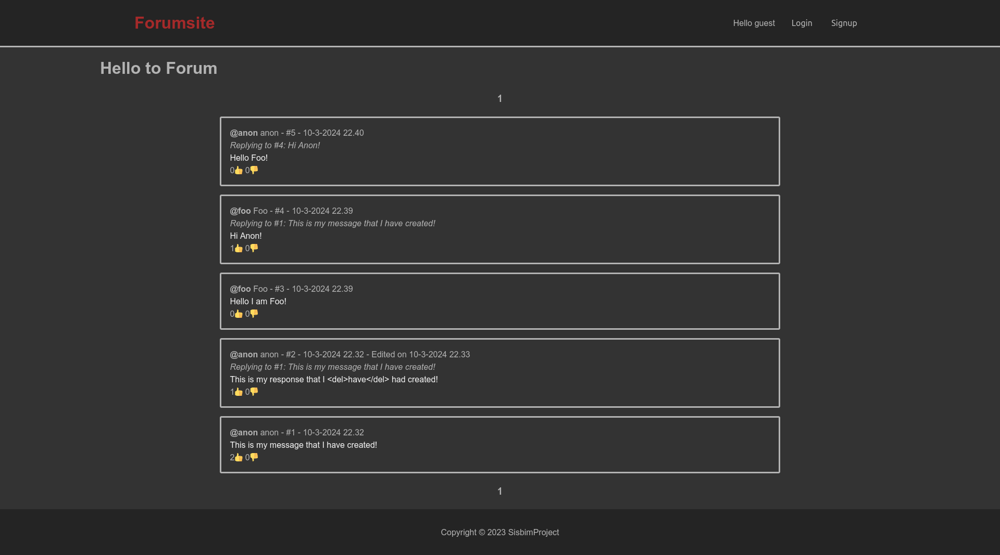
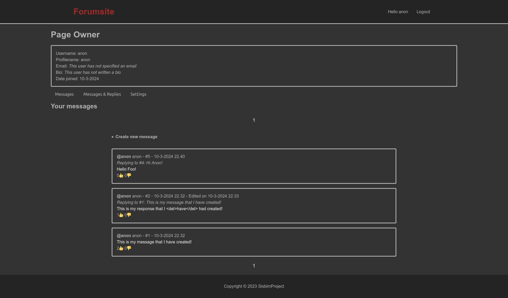
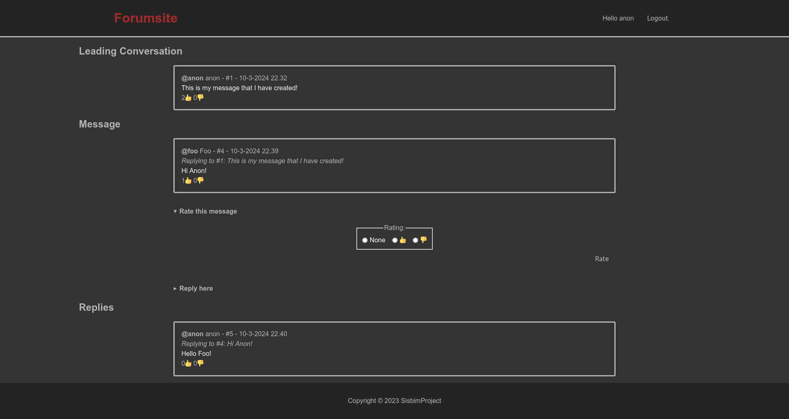
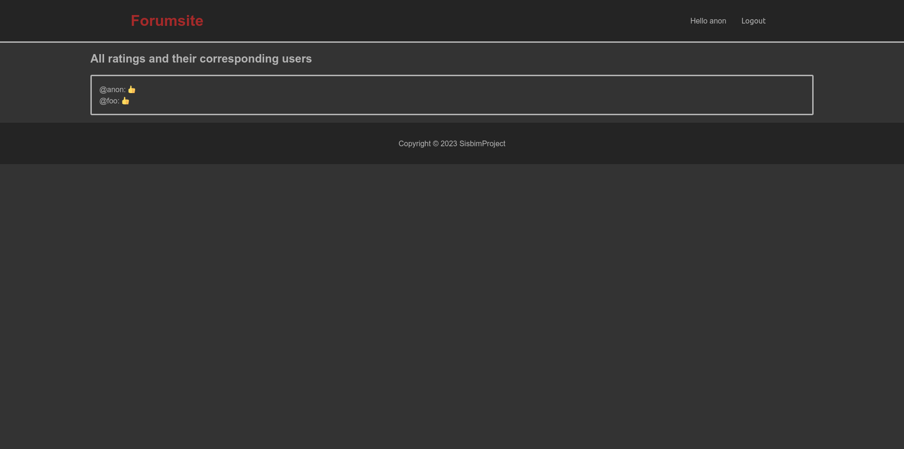
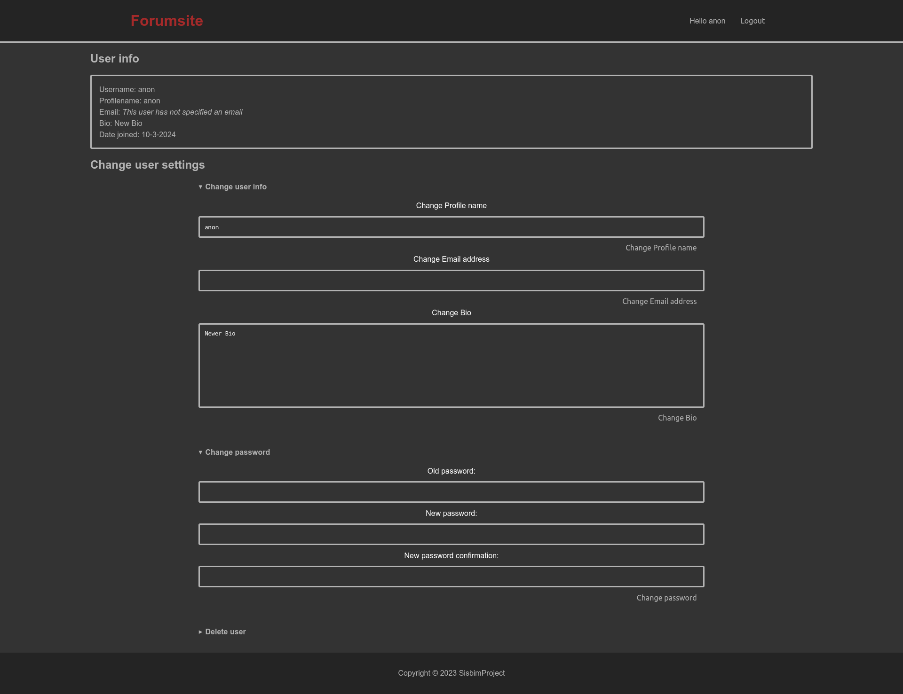

# Django Twitter Clone

This project is a Twitter clone website developed during my mandatory summer internship at _Sisbim Teknoloji ve Yazılım Şirketi A.Ş._ The project was intended for educational purposes and is not suitable for deployment in its current state.

The website is developed using the Django web framework. 

For the database, SQLite is used.

For webpage generation Server-Side Rendering (SSR) with the Django templating language is used.

## Dependencies

For dependencies, Python3 is required. The rest of the dependencies are listed in the _requirements.txt_ file and can be installed through pip by using the following script.
```bash
pip install -r requirements.txt
```

The project was developed with Django version 4.2. The code does not work with Django version >5.0 due to [the deprecation of a feature which was utilized in this project](templates/base.html#L19).

## Deployment

Make sure to change the SECRET_KEY variable in the [project/.env](project/.env) file for security reasons.

## Gallery 

### Main Page


### Account Page


### Message Page


### Ratings Page


### Settings Page

